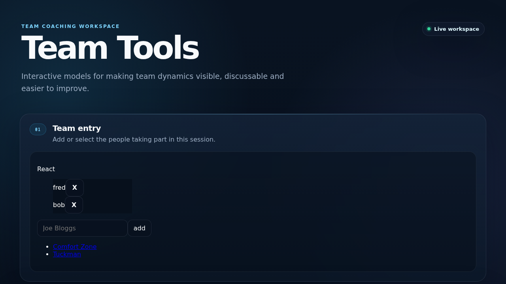

# TeamTools walkthrough

**Live application:** https://team-tools.digiguru.co.uk



_Current live TeamTools interface used as the facilitator-led reference implementation._

TeamTools demonstrates the deliberately non-realtime end of the `live-session` design.

It is facilitator-led: one browser manages named participants and records their responses across different team exercises.

## Screen 1 — Participant entry

The facilitator creates the people taking part.

### What the application owns

- participant names;
- entry form;
- browser-local persistence;
- presentation/order of participants.

### What maps to live-session

Each TeamTools `User` maps to a **Participant** with a stable ID.

This is important because the shared model does not assume participants are anonymous.

## Screen 2 — Choose an exercise

TeamTools contains multiple models within one facilitator workspace, including Comfort and Tuckman.

This was the evidence that introduced **Activity** into the shared model.

```text
Session
  Comfort activity
  Tuckman activity
```

Without Activity, the library would incorrectly assume every session has one contribution schema.

## Screen 3 — Comfort model

The facilitator records where a participant sits in the Comfort model using a zone and distance.

### What the application owns

- Comfort zones;
- SVG interaction;
- distance semantics;
- rendering.

### What maps to live-session

The model-specific choice becomes a generic **Contribution**:

```ts
{
  participantId,
  activityId: "comfort",
  value: {
    zone,
    distance
  }
}
```

The library does not need to understand what a Comfort zone means.

## Screen 4 — Tuckman model

A participant's Tuckman response has a different domain vocabulary but fits the same contribution envelope.

```ts
{
  participantId,
  activityId: "tuckman",
  value: {
    zone,
    distance
  }
}
```

This is the strongest evidence for separating contribution structure from domain values.

## Screen 5 — Combined visualization

TeamTools renders collected responses into model-specific SVG results.

### What the application owns

All aggregation and visualization.

There is no useful generic "render aggregate" implementation shared with Wheel of Emotion, so the library intentionally does not attempt one.

## Where presence is *not* used

TeamTools currently has no participant sockets or multi-browser transport.

It therefore does not display:

- connected participants;
- realtime presence;
- waiting participants;
- host credentials.

The package still contains transport-neutral presence calculations because Wheel proved the capability, but TeamTools does not manufacture fake presence state simply to exercise the API.

## Why this example matters

TeamTools proves that the core can support:

```text
named facilitator-managed participants
+ local/browser operation
+ multiple activities
+ activity-specific contributions
+ no realtime presence
+ no host authorization
```

This prevents `live-session` from collapsing into a WebSocket voting library.
