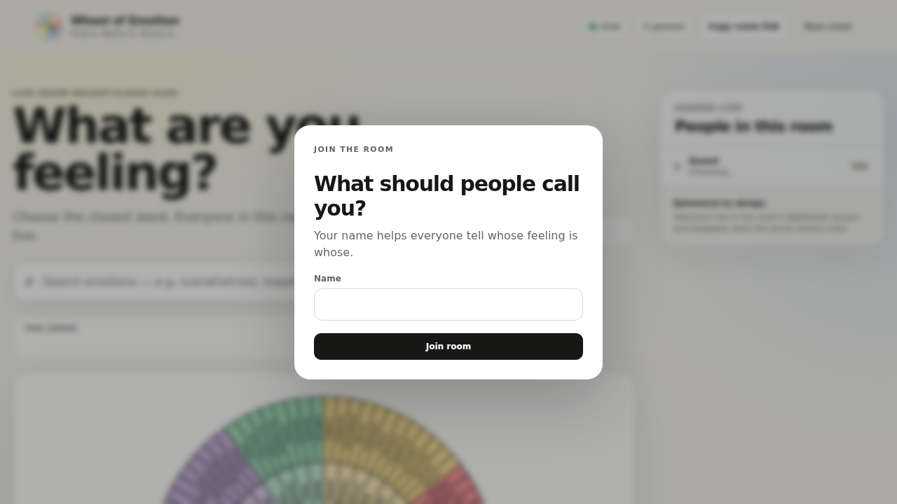

# Wheel of Emotion walkthrough

**Live application:** https://emotion.digiguru.co.uk



_Current live Wheel of Emotion interface used as the realtime reference implementation._

Wheel of Emotion demonstrates the realtime end of the `live-session` design.

It uses anonymous room-scoped participant identities, WebSocket transport, host authorization, replace-current contributions and engagement-aware presence.

## Screen 1 — Host dashboard

The host starts at the dashboard and creates a named room.

### What the application owns

- room naming UX;
- the list of the host's previous rooms;
- saved emotion snapshots;
- service-health presentation.

### What maps to live-session

- room → **Session**;
- host token → optional **HostAuthorization**;
- open/closed room → session lifecycle.

The shared library does not dictate what a dashboard looks like.

## Screen 2 — Live room

The room has a clean public URL that participants can open without an account.

Each browser receives a random room-scoped participant ID.

### What maps to live-session

- browser identity → **Participant.id**;
- WebSocket → optional **RealtimeTransport**;
- current room → **Session**.

The participant's name is never required by the library.

## Screen 3 — Emotion wheel and search

A participant searches or navigates the emotion wheel and chooses one emotion.

### What the application owns

- the 130-emotion taxonomy;
- SVG wheel rendering;
- emotion search;
- valid emotion IDs;
- labels and colors.

### What maps to live-session

The selected emotion is a **Contribution**.

Wheel uses a replace-current policy:

```text
participant A
Overwhelmed → Hopeful
```

There is still one current contribution for that participant.

## Screen 4 — Host presence / waiting state

The host sees several different notions of participation:

- connected;
- active now;
- active + voted;
- waiting on.

An unvoted participant who stops interacting for more than the configured activity timeout falls out of the active/waiting count without needing the socket to disconnect.

A participant who has voted remains active for presence purposes while connected.

### What maps to live-session

This is the optional **Presence** capability:

```text
connected
active
contributed
waiting
```

Presence deduplicates multiple sockets that share one participant ID.

## Screen 5 — Group emotion cloud

The host sees aggregate emotion results update live.

### What the application owns

- counting emotion IDs;
- category totals;
- cloud rendering;
- colors and animation.

The library supplies contribution/session structure but deliberately does not know how to aggregate emotions.

## Screen 6 — Saved rooms and comparison

The host can save aggregate snapshots locally and compare sessions over time.

This demonstrates why **Persistence** is separate from transport: the live room currently exists in server memory while saved aggregate history exists in the host browser.

A future application could swap either storage choice without redefining Session or Participant.

## Screen 7 — Close room

The host closes the session and participant voting stops.

This maps directly to session lifecycle while leaving Wheel-specific completion copy and UX in the application.

## Why this example matters

Wheel proves that the core can support:

```text
anonymous participants
+ realtime transport
+ engagement presence
+ host authorization
+ replace-current contributions
```

without requiring those capabilities for every consumer.
